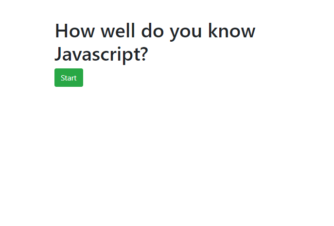

# Code-Quiz

An interactive multiple choice quiz game to test your JavaScript skills!

## Description

This quiz game features multiple choice questions that challenges the user. Upon hitting the start button a timer will begin counting down from 30 seconds and the questions will begin. If they select the correct answer they will gain one point. If they answer incorrectly they will lose a point and 5 seconds will be deducted from the clock. After the series of questions are completed or time runs out, whichever occurs first, their final score will be shown. An input box will show up for the user to log their initials. Their initials and score will be kept and shown for reference when they play again.

## Skills Showcased

Adding event handlers to listen for button clicks
Setting a timer using setInterval
Traversing and manipulating the DOM
Storing user data in local storage

## Challenges I faced during this project

This application required several concepts that were difficult to implement. The hardest part for me was getting my questions to display on the DOM dynamically. I wanted to use Javascript to show my questions rather than coding them into the HTML document. I was able to store each question in an array as an object and display them by referencing it's index number. Setting up event listeners to listen for clicks on the buttons was also challenging for me. Especially adding in conditional statements inside the event handlers.

## Link to to the code quiz game

https://tlam1288.github.io/Code-Quiz/

## Screenshots of the game

;
;
;
